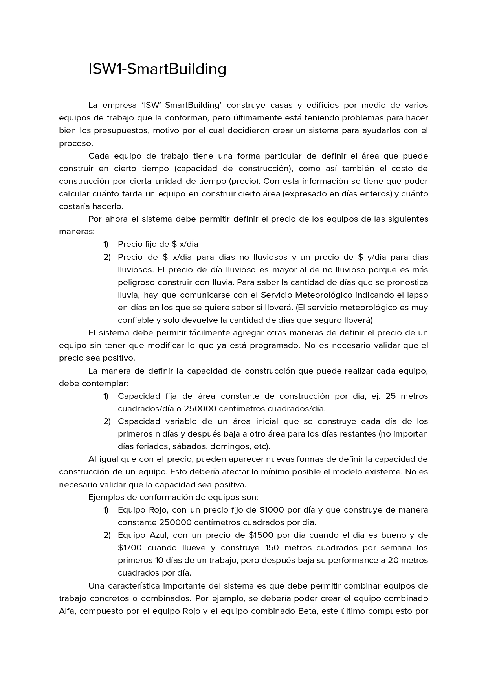
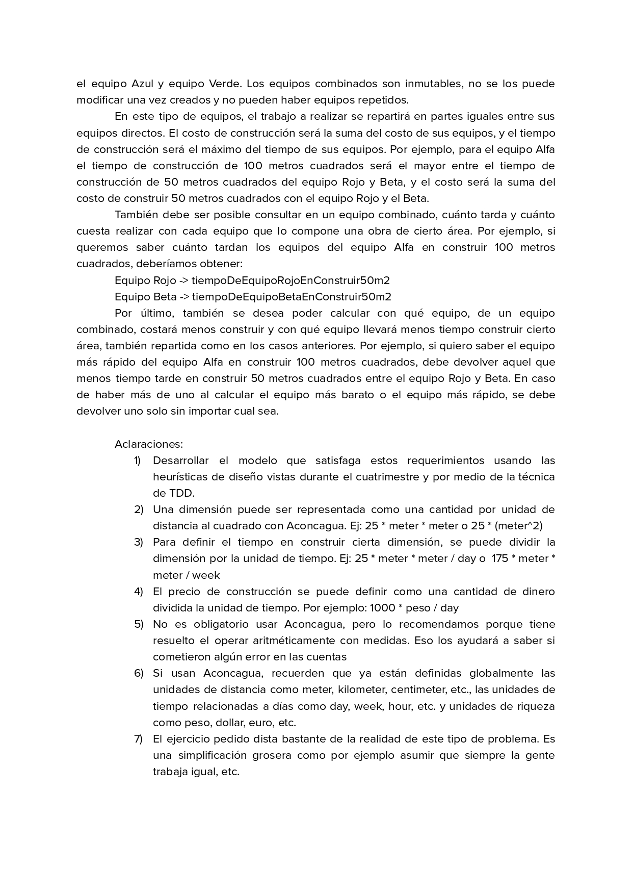

# SmartBuilding
Sistema para la gestión de equipos en una empresa de construcción. Parcial de POO y patrones de diseño adaptado a GO con TDD y Testify. Originalmente se resolvía con Smalltalk para la materia Ingeniería de Software I.

## Sources
- Parciales de la materia: https://github.com/UBA-FCEN-IngSoft1/Parciales
- Materia: [Ingeniería de Software I, Facultad de Ciencias Exactas y Naturales, Universidad de Buenos Aires]( https://www.isw2.com.ar/)
- Profesor: [Hernán Wilkinson](https://x.com/HernanWilkinson)

## Aspectos principales del parcial (y adaptarlo a golang)
- TDD con tipado fuerte. En algunos casos nos tenemos que adelantar con la implementación porque no tenemos "MessageNotUnderstood" y al usar un tipo como implementador de una interfaz tenemos que crearle todos los métodos de esta, caso contrario el compilador se queja. No permite un crecimiento orgánico e iterativo.
- Ignoramos las medidas, unidades de dinero, unidades de tiempo. Agregan muchas dificultades accidentales. Caso contrario las implementaciones genéricas se vuelven muy rebuscadas y específicas lo que no aporta al proyecto en si.
- Uso de mocks. Simulamos el sistema meteorológico mediante los mocks de testify.
- Generics. El uso de generics para operaciones de buscar el máximo/mínimo elemento que cumple una condición en un arreglo o el máximo/mínimo valor en un arreglo mapeado.
- Patrones de diseño: Visitor, Composite y Active Variable (o proxy-wrapper).
- Testeo de panics.
- Mensajes de errores modularizados.

## Requirements

